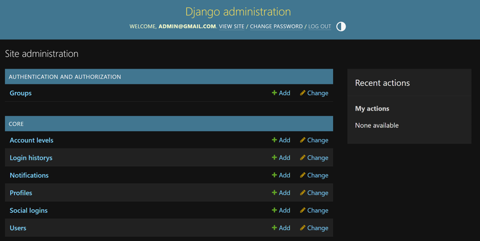
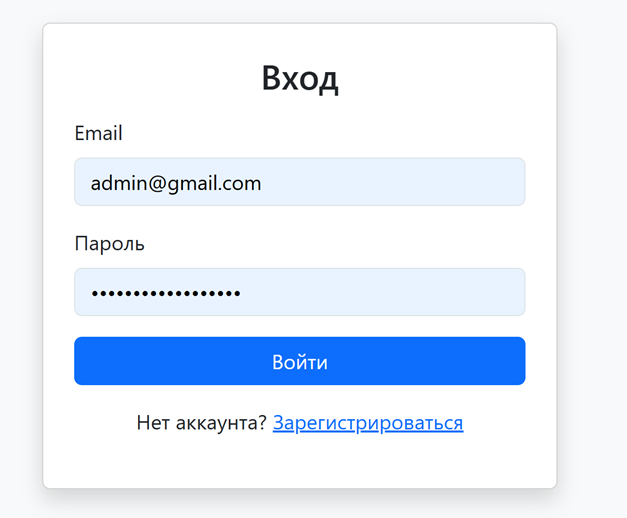
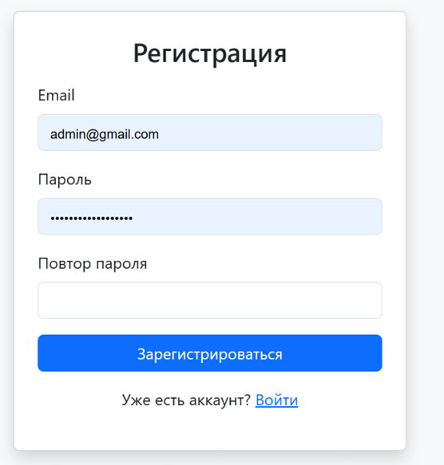
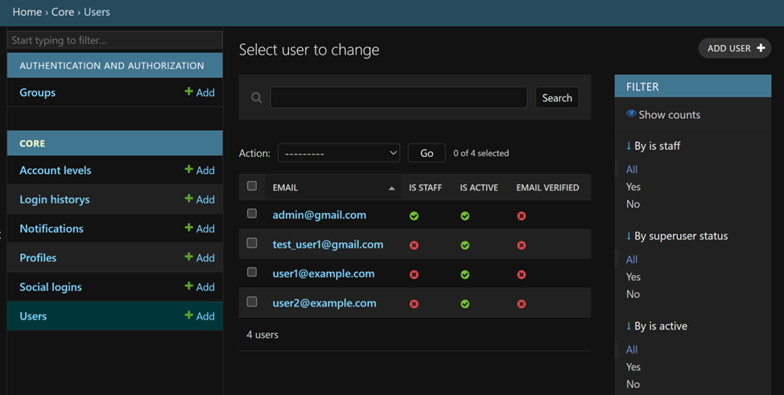
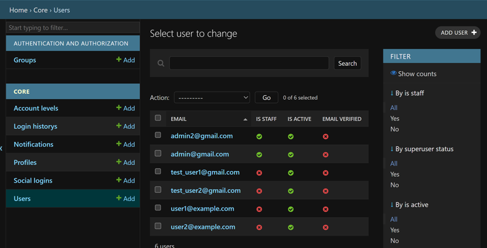

# Отчёт о реализации функционала пользователей

## Админка и тестирование через `admin.py`
Мы подключили модели к Django Admin для удобного тестирования и управления:

```python
from django.contrib import admin
from .models import User, Profile, AccountLevel, Notification, SocialLogin, LoginHistory
from django.contrib.auth.admin import UserAdmin as BaseUserAdmin

@admin.register(User)
class CustomUserAdmin(BaseUserAdmin):
    ordering = ('email',)
    list_display = ('email', 'is_staff', 'is_active', 'email_verified')
    fieldsets = (
        (None, {'fields': ('email', 'password')}),
        ('Permissions', {'fields': ('is_active', 'is_staff', 'is_superuser', 'groups', 'user_permissions')}),
        ('Important dates', {'fields': ('last_login', 'created_at')}),
    )
    add_fieldsets = (
        (None, {
            'classes': ('wide',),
            'fields': ('email', 'password1', 'password2', 'is_staff', 'is_superuser'),
        }),
    )

admin.site.register(Profile)
admin.site.register(AccountLevel)
admin.site.register(Notification)
admin.site.register(SocialLogin)
admin.site.register(LoginHistory)
```



### Суперпользователь для доступа к админке:

URL: https://voltusv.pythonanywhere.com/admin/

Логин: admin@gmail.com

Пароль: admin123@gmail.com

---

## URLs и маршрутизация

backend/users/urls.py


```python

from django.urls import path
from . import views

urlpatterns = [
    path("register/", views.register_view, name="register"),
    path("login/", views.login_view, name="login"),
]
```

backend/allways_project/urls.py

```python
from django.contrib import admin
from django.urls import path, include, re_path
from core.views import FrontendAppView

urlpatterns = [
    path('admin/', admin.site.urls),
    path("users/", include("users.urls")),
    re_path(r'^(?!admin/|users/).*$', FrontendAppView.as_view(), name='home'),
]

```

---

## Фронтенд

Шаблоны: register.html и login.html (backend/users/templates/users/)

Используется Bootstrap для стилизации и клиентской валидации

Email и пароль проверяются на клиенте, POST-запрос отправляется на сервер

URL:

Регистрация: https://voltusv.pythonanywhere.com/users/register/

Вход: https://voltusv.pythonanywhere.com/users/login/





---

Views (backend/users/views.py)

```python
from django.shortcuts import render, redirect
from django.contrib.auth import get_user_model, authenticate, login

User = get_user_model()

def register_view(request):
    if request.method == "POST":
        email = request.POST.get("email")
        password = request.POST.get("password")
        if User.objects.filter(email=email).exists():
            return render(request, "users/register.html", {"error": "Email занят"})
        user = User.objects.create_user(email=email, password=password)
        login(request, user)
        return redirect("/")
    return render(request, "users/register.html")

def login_view(request):
    if request.method == "POST":
        email = request.POST.get("email")
        password = request.POST.get("password")
        user = authenticate(request, email=email, password=password)
        if user:
            login(request, user)
            return redirect("/")
        return render(request, "users/login.html", {"error": "Неверный email или пароль"})
    return render(request, "users/login.html")

```

---

## Модель пользователя (core/models.py)

Кастомная модель User на базе AbstractBaseUser + PermissionsMixin

Менеджер UserManager с методами create_user и create_superuser

Поля: email (уникальный), пароль, is_active, is_staff, email_verified, last_login, created_at, updated_at, failed_attempts

### Примеры тестирования
```python
# Суперпользователь
admin = User.objects.create_superuser("admin2@gmail.com", "adminpass")
print(admin)  # admin2@gmail.com

# Обычный пользователь
from django.contrib.auth import authenticate

user = authenticate(email="test_user2@gmail.com", password="12345")
print(user)  # <User: test_user2@gmail.com>

user = authenticate(email="test_user2@gmail.com", password="wrongpass")
print(user)  # None

```



---


## Кратко как работает

Фронтенд: форма HTML + Bootstrap → POST-запрос на сервер

View: получает данные, создаёт пользователя (create_user) или проверяет (authenticate)

Модель: хэширует пароль и сохраняет в БД

База данных: хранит пользователей и связанные модели, обеспечивает проверку при авторизации


---

## Примечания:

*** Убрал password_hash из models.py, чтобы убрать ошибку, свзяанную с тем, что не получается авторизовать пользователя в системе