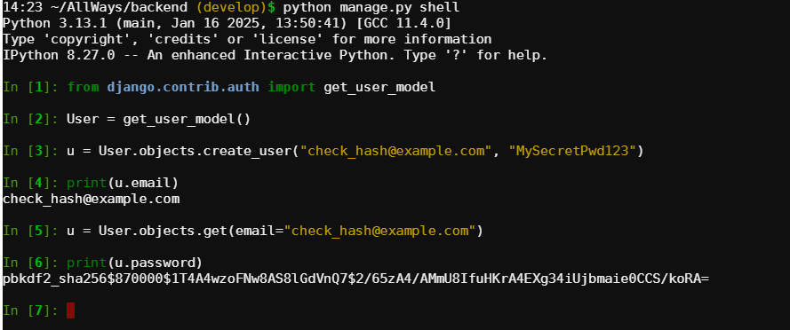

## Django по умолчанию хеширует пароли

### Как это работает:

- Когда пользователь регистрируется (или меняет пароль), пароль не сохраняется в базе данных в открытом виде. Вместо этого сохраняется хэш пароля.

- Когда пользователь пытается войти, Django использует метод check_password() для того, чтобы проверить введённый пароль, хэшируя его и сравнивая с хранимым хэшем в базе данных.

- Алгоритм по умолчанию — PBKDF2:
Это один из самых распространённых и безопасных алгоритмов для хэширования паролей. Django по умолчанию использует PBKDF2 с 100,000 итерациями, что делает процесс хэширования пароля медленным и усложняет атаки методом подбора.

- Доступ к паролю:
Хэширование пароля является необратимым процессом. Даже если кто-то получит доступ к базе данных, они не смогут восстановить исходный пароль, так как хэш не поддаётся расшифровке.

---

## Проверил на сервере

