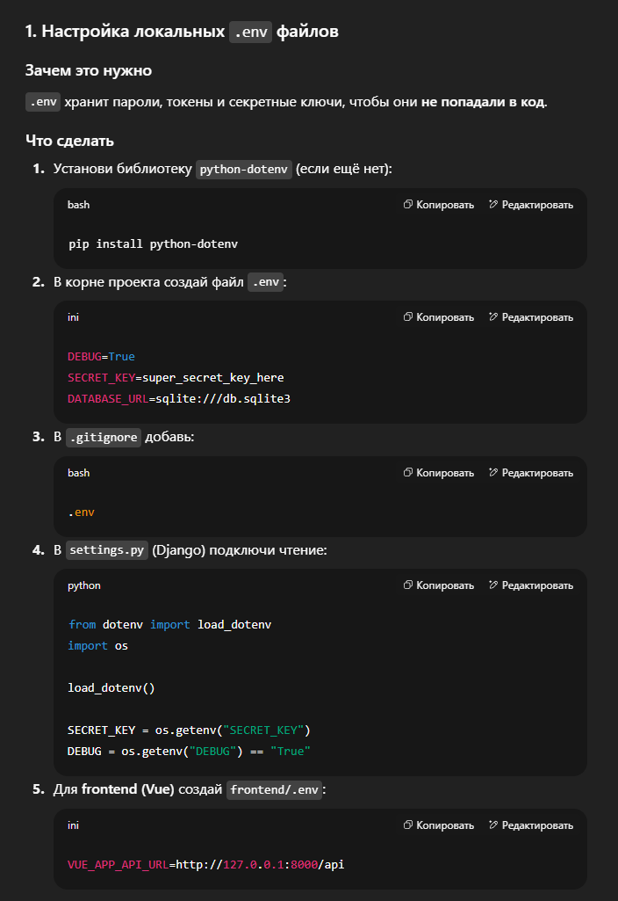

# 📚 Руководство по работе с проектом AllWays

## 1. Введение
**AllWays** — мультиплатформенный сервис для построения комбинированных маршрутов и оплаты билетов.  
В проекте участвуют:
- **Backend** — Django (Python)
- **Frontend** — Vue.js
- **Мобильное приложение** — Android WebView (Java)
- **Инфраструктура** — CI/CD

**Цель инструкции** — помочь новичку быстро настроить окружение и понять рабочий процесс в команде.

---

## 3. Настройка окружения и запуск проекта

### 3.1. Backend (Python/Django)
```bash
# Перейти в папку backend
cd backend

# Создать виртуальное окружение
python -m venv venv

# Активировать виртуальное окружение
# Windows:
venv\Scripts\activate
# или
source venv/Scripts/activate
# Linux/macOS:
source venv/bin/activate

# Установить зависимости
pip install -r requirements.txt

# Применить миграции
python manage.py migrate

# Запустить сервер
python manage.py runserver
```
Примечание:
``` bash
# python manage.py migrate
Применяет миграции — т.е. обновляет структуру базы данных на основе моделей Python (создаёт таблицы, добавляет поля и т.д.).
📌 Это нужно запускать каждый раз, когда меняется структура моделей (models.py).

# python manage.py runserver
Запускает локальный сервер разработки Django (по умолчанию на http://127.0.0.1:8000).
📌 Используется для тестов и отладки, в продакшене будет другой способ запуска.
```

---

### 2. Структура репозитория
<pre>
AllWays/
├── backend/                # Серверная часть на Django
│  ├── allways_project/     # Django проект
│  ├── routing/             # Приложение маршрутизации
│  ├── payments/            # Приложение оплаты
│  ├── users/               # Приложение пользователей
│  ├── notifications/       # Приложение уведомлений
│  ├── venv/                # Виртуальное окружение Python (не коммитится)
│  ├── requirements.txt     # Список Python зависимостей
│  └── README.md            # Документация бэкенда
├── frontend/               # Веб-клиент на Vue.js
│  ├── node_modules/        # Зависимости Node.js (не коммитятся)
│  ├── src/                 # Исходный код Vue.js
│  ├── public/              # Статические файлы фронтенда
│  ├── package.json         # Зависимости и скрипты npm
│  └── README.md            # Документация фронтенда
├── mobile/                 # Мобильное приложение (Android WebView) 
│  ├── android_webview_app/ # Проект Android Studio (Java) 
│  └── README.md            # Документация мобильного приложения
├── docs/                   # Документация проекта 
├── scripts/                # Скрипты автоматизации (деплой, миграции и др.) 
│  └── README.md            # Документация скриптов для деплоя
├── README.md               # Основное описание проекта 
└── .gitignore              # Правила исключения файлов из Git 
</pre>


---

### 3.2. Frontend (Vue.js)

```bash
# Установите Node.js (например, node-v22.18.0-x64.msi)
# Для загрузки наберите в браузере: 
node.js

# Перейти в папку frontend
cd ../frontend

# Установить зависимости npm
npm install

# Запустить dev-сервер
npm run serve

# Откройте браузер по адресу, который выведется в консоли (обычно http://localhost:8080)
```
Структура папок frontend
```bash
frontend/
│
├── public/         # Статические файлы (favicon, index.html)
├── src/            # Исходный код фронтенда
│   ├── assets/     # Картинки, стили, шрифты
│   ├── components/ # Мелкие переиспользуемые Vue-компоненты
│   ├── views/      # Страницы (маршруты)
│   ├── router/     # Настройка маршрутизации
│   ├── store/      # Vuex (хранилище состояния)
│   └── App.vue     # Корневой компонент
│
└── package.json    # Зависимости и скрипты

```
👉 Весь код пишется в frontend/src/ — компоненты, страницы, стили и т.д.
public/ используется в основном для статики и HTML-шаблона.


---

### 3.3. Мобильное приложение (Android WebView на Java)
``` bash
# 1. Откройте Android Studio.
# 2. Откройте папку проекта:
    /mobile/android_webview_app

# 3. Основная задача — создать WebView, который будет показывать веб-версию фронтенда (например, http://localhost:8080 или адрес продакшен-сервера).
```
```Java
// 4. Пример базового WebView в MainActivity.java:

import android.os.Bundle;
import android.webkit.WebSettings;
import android.webkit.WebView;
import androidx.appcompat.app.AppCompatActivity;

public class MainActivity extends AppCompatActivity {
    private WebView webView;
    
    @Override
    protected void onCreate(Bundle savedInstanceState) {
        super.onCreate(savedInstanceState);
        webView = new WebView(this);
        setContentView(webView);

        WebSettings webSettings = webView.getSettings();
        webSettings.setJavaScriptEnabled(true);
        webView.loadUrl("http://your-frontend-url");
    }
}
```
```bash
# 5. Для полноценной разработки добавляйте новые активности, UI и связывайте с backend.
```

---


### 4. Работа с Git и ветвлением
``` bash
# 4.1. Основные ветки в репозитории
# main — стабильная ветка с продакшен-кодом.
# develop — ветка для интеграции новых функций.

# 4.2. Feature-ветки
# Для разработки новых функций используйте отдельные ветки по шаблону:

# Для мобильных:
feature/mobile/название_фичи
# Для фронтенда:
feature/frontend/название_фичи
# Для бэкенда:
feature/backend/название_фичи


# 4.3. Создание feature-ветки

git checkout develop
git pull origin develop
git checkout -b feature/frontend/login-form


# 4.4. Работа с feature-веткой

# Делайте коммиты локально.
# Пушьте ветку в удалённый репозиторий:
# git push -u origin feature/frontend/login-form
# Создавайте Pull Request (PR) в ветку develop через GitHub.

# 4.5 📝 Формат сообщений коммитов

feat: добавлен компонент авторизации
fix: исправлена ошибка отображения карты
docs: обновлено руководство
style: отформатирован код
refactor: упрощена логика маршрутов
test: добавлены тесты API


```

---

### 5. Pull Request и код-ревью

``` bash
# Все изменения должны проходить через Pull Request в ветку develop.

# Для слияния в develop требуется минимум 1-2 одобрения от коллег (обязательное код-ревью).

# Нельзя пушить напрямую в main или develop — только через PR.

# В PR обязательно проверяйте, что все тесты и линтеры проходят успешно.
```

---

### 6. CI/CD

``` bash
# 6.1. Что такое CI/CD?
CI (Continuous Integration) — автоматическая проверка кода (тесты, линтинг) при каждом PR и пуше.

# CD (Continuous Delivery/Deployment) — автоматический деплой приложения на сервер после успешных проверок.

# 6.2. В нашем проекте настроен GitHub Actions:
При пуше в develop или main запускаются тесты фронтенда и бэкенда.
Если тесты не проходят — PR не может быть замержен.


# По мере развития проекта можно добавить деплой в staging и production.

```

---

### 7. Организация папок и файлов

```bash

Папка	        Назначение
backend/	  Сервер на Django, приложения, виртуальное окружение Python
frontend/	    Vue.js SPA — исходники фронтенда и конфигурация npm
mobile/	     Android-проект на Java с WebView
docs/	  Документация проекта
scripts/	    Скрипты для миграций, деплоя и других задач

```

---

### 8. Полезные советы

```bash
# Перед началом работы всегда обновляй ветку develop:
git checkout develop
git pull origin develop

# Работай в своей feature-ветке — не трогай другие ветки.
# Часто коммить и пушь изменения, чтобы не потерять работу.

# Всегда создавай PR для внесения изменений.
# Уважай коллег, делай качественные ревью.
# Вопросы по проекту задавай в общем чате или напрямую.
```

---

# Важно, но пока не настроено.




---


---